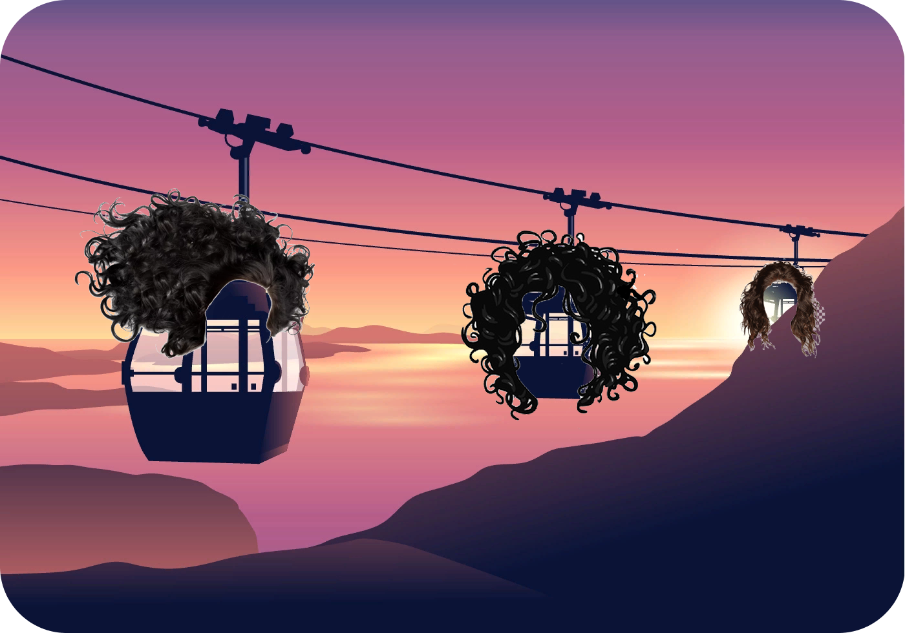

<div align="center">
  <h1>curly-funicular</h1>
  
</div>

## Usage
You will need to include the JavaScript file `curly-funicular.js` (or the minified version `curly-funicular.min.js`). No jQuery required!😊

### Including files
Place the script in front of the closing body tag.
```html
<script src="curly-funicular.js"></script>
```

### Required HTML structure
Declare the menu with id, href links, data-cfmenuanchor menu items with the pre-defined active style in this way.
```html
<div id="menu">
    <div class="active" data-cfmenuanchor="first">
        <a href="#first">
            First
        </a>
    </div>
    <div data-cfmenuanchor="second">
        <a href="#second">
            Second
        </a>
    </div>
    <div data-cfmenuanchor="third">
        <a href="#third">
            Third
        </a>
    </div>
</div>
```
Each section will be defined with a div containing the data-cfanchor property. The active section by default will be the first section.
```html
<div data-cfanchor="first">Some section</div>
<div data-cfanchor="second">Some section</div>
<div data-cfanchor="third">Some section</div>
```

### Initialization
```javascript
curlyFunicular.init({
    anchors: ['#header', '#works', '#contacts'],
    offset: 200
});
```
### Accesing sections
In order to create links to a certain section, you can use a normal URL link if you are using curly-funicular with anchor links (using the `anchors` option), then you will be able to use anchor links also to navigate directly to a certain section. For example: http://example.com/index.html#page2


**Be careful!** `data-cfanchor` tags can not have the same value as any ID element on the site.

### Using a menu
To link the menu with the active section you will have to make use of anchor links (#) as explained below in the options section.

## Options
- `anchors`: (required) Defines the anchor links (#example) to be shown on the URL for each section. This option also allows users to bookmark a specific section. **Be careful!** if you use anchors, they can not have the same value as any ID element on the site.
- `offset`: (default `0`) Determines how much you need to scroll to the next section for the menu to become active on it. Calculated as the height of the section minus the offset. It is necessary for a better user experience, especially when the user scrolls to the last section. When clicking on an anchor link, scrolling does not take into account the offset.

## License
MIT License

Copyright (c) 2021 valeriyshashkin

Permission is hereby granted, free of charge, to any person obtaining a copy of this software and associated documentation files (the "Software"), to deal in the Software without restriction, including without limitation the rights to use, copy, modify, merge, publish, distribute, sublicense, and/or sell copies of the Software, and to permit persons to whom the Software is furnished to do so, subject to the following conditions:

The above copyright notice and this permission notice shall be included in all copies or substantial portions of the Software.

THE SOFTWARE IS PROVIDED "AS IS", WITHOUT WARRANTY OF ANY KIND, EXPRESS OR IMPLIED, INCLUDING BUT NOT LIMITED TO THE WARRANTIES OF MERCHANTABILITY, FITNESS FOR A PARTICULAR PURPOSE AND NONINFRINGEMENT. IN NO EVENT SHALL THE AUTHORS OR COPYRIGHT HOLDERS BE LIABLE FOR ANY CLAIM, DAMAGES OR OTHER LIABILITY, WHETHER IN AN ACTION OF CONTRACT, TORT OR OTHERWISE, ARISING FROM, OUT OF OR IN CONNECTION WITH THE SOFTWARE OR THE USE OR OTHER DEALINGS IN THE SOFTWARE.
